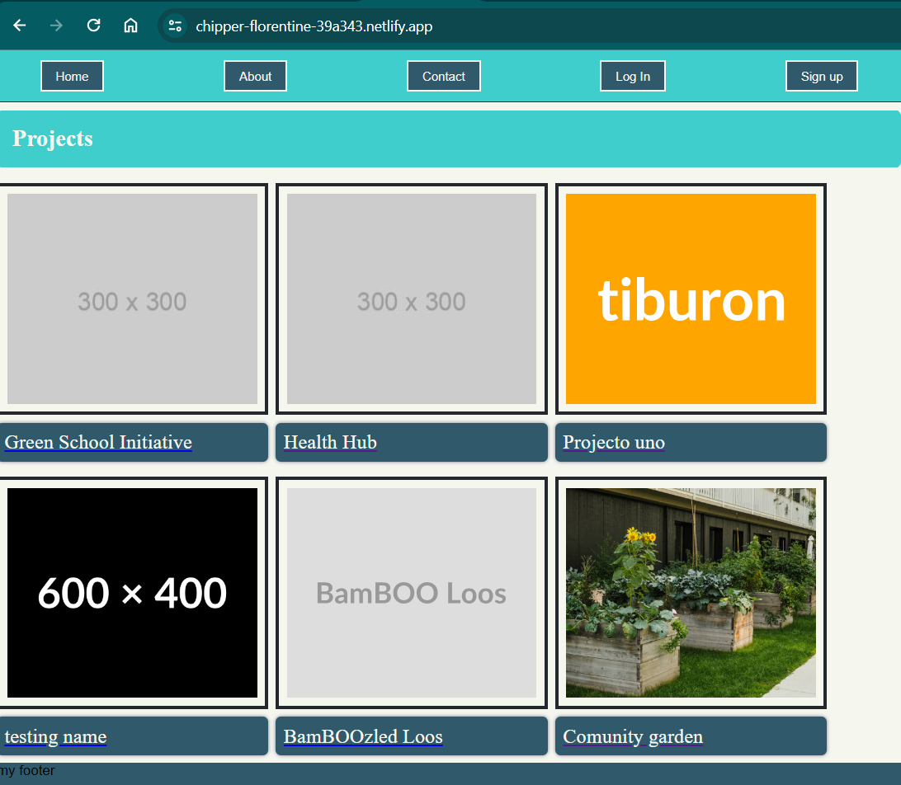
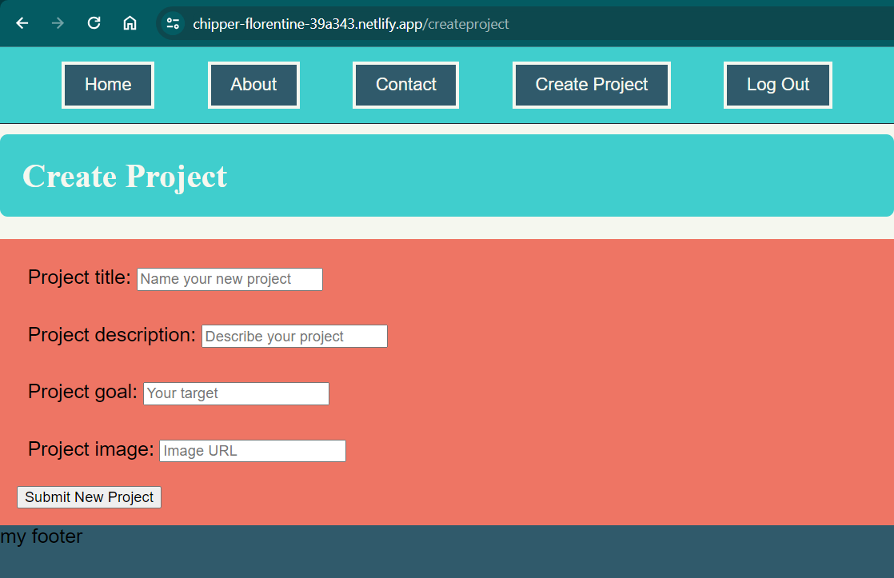
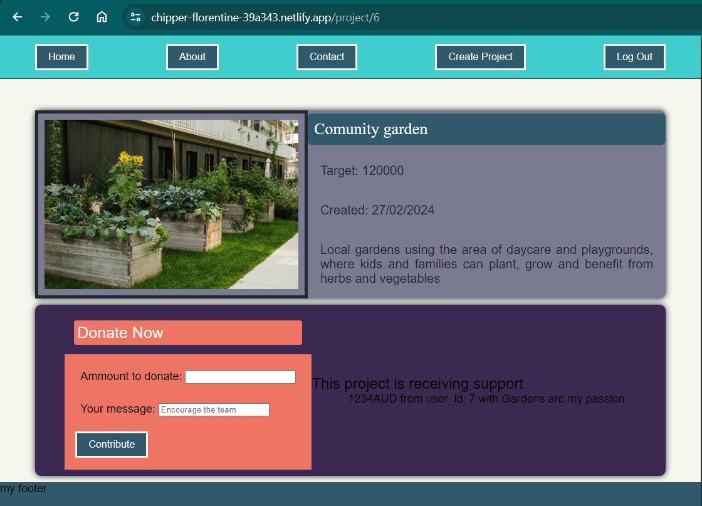

# Lanie's FrontEnd project with ReactJS
this repo contains code that follows the content of the SheCodes Plus Perth Cohort of 2023-24
Here we intreact with the crowdfunding API built using DFR (see repo in https://github.com/lruizper/crowdfunding_back_end) which was deployed and is available at https://crowdfunding-back-end-lrp.fly.dev/ 

## Deployed poject
This project was deployed with Netlify and can be found by clicking this [link here](https://chipper-florentine-39a343.netlify.app/)

## Homepage
describe features

## Project creation page
describe features

## Project creation form

## Project with pledges
A project showing the title, description, image and pledges

## Handling unauthorized user
describe funtionality and show what happens when an unauthorised user attemps to edit a project 
insert image here
